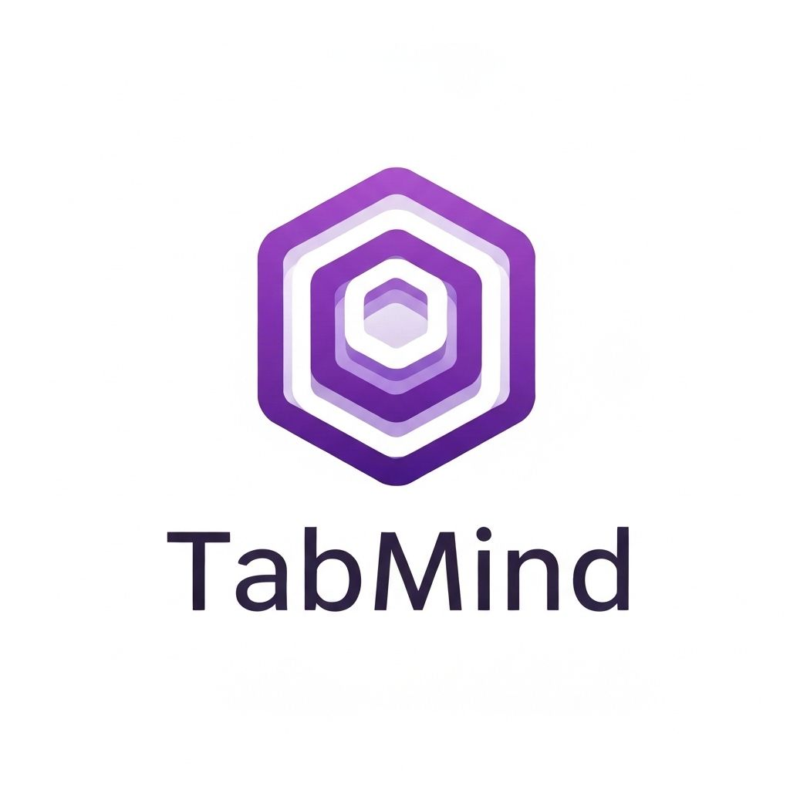

# TabMind - Intelligent Workspace for Chrome

**Transform tab chaos into clarity with AI-powered workspace intelligence.**

TabMind is a Chrome extension that uses Google Chrome's built-in AI (Gemini Nano) to automatically analyze, cluster, and organize your browser tabs into meaningful workspaces. Say goodbye to tab overload and hello to intelligent productivity.

## 🚀 Features

### 🧠 AI-Powered Tab Clustering
- Automatically groups related tabs using Chrome's Prompt API
- Understands context from page titles, URLs, and content
- Creates meaningful workspace categories in real-time

### 📊 Visual Workspace Dashboard
- Clean, modern side panel interface
- See all your tab clusters at a glance
- Real-time statistics and insights

### 🎯 Smart Tab Groups
- One-click application of AI-generated clusters as Chrome tab groups
- Color-coded organization for easy navigation
- Maintains your workflow without disruption

### ⚡ Privacy-First Design
- All AI processing happens locally in your browser
- No data sent to external servers
- Uses Chrome's built-in Gemini Nano model

### 🔄 Continuous Analysis
- Monitors tab changes in real-time
- Automatically updates clusters as you browse
- Learns from your browsing patterns

## 📦 Installation

### From Source (Development)

1. Clone this repository:
   \`\`\`bash
   git clone https://github.com/yourusername/tabmind.git
   cd tabmind
   \`\`\`

2. Open Chrome and navigate to `chrome://extensions/`

3. Enable "Developer mode" (toggle in top right)

4. Click "Load unpacked" and select the extension directory

5. The TabMind icon should appear in your extensions toolbar

### Prerequisites

TabMind requires Chrome 138+ with built-in AI capabilities:
- Windows 10/11, macOS 13+, Linux, or ChromeOS
- At least 22 GB of free storage
- More than 4 GB of GPU VRAM
- Unmetered network connection (for initial AI model download)

## 🎯 Usage

1. **Open TabMind**: Click the TabMind icon in your Chrome toolbar to open the side panel

2. **Browse Normally**: Open tabs as you usually would - research, shopping, work, etc.

3. **Let AI Analyze**: TabMind automatically analyzes your tabs and creates intelligent clusters

4. **View Workspaces**: See your tabs organized into meaningful categories in the side panel

5. **Apply Groups**: Click "Apply Tab Groups" to organize your actual Chrome tabs into groups

6. **Navigate Easily**: Click any tab in the side panel to switch to it instantly

## 🏗️ Architecture

### Components

- **Background Service Worker** (`background.js`): Monitors tabs, runs AI analysis, manages state
- **Side Panel UI** (`sidepanel.html`, `sidepanel.js`, `styles.css`): User interface and interactions
- **Content Script** (`content.js`): Extracts page metadata for enhanced analysis

### AI Integration

TabMind leverages three Chrome built-in AI APIs:

1. **Prompt API**: Analyzes tab relationships and generates intelligent clusters
2. **Summarizer API**: Creates concise summaries of page content
3. **Translator API**: (Future) Multi-language support for international users

### Data Flow

\`\`\`
User Opens Tabs → Background Worker Monitors → AI Analyzes Content → 
Clusters Generated → Side Panel Updates → User Applies Groups
\`\`\`

## 🎨 Design Philosophy

TabMind follows a **dark-first, minimal, professional** design language:
- Clean typography with system fonts
- Subtle animations and transitions
- High contrast for accessibility
- Responsive to different panel widths

## 🔧 Development

### Project Structure

\`\`\`
tabmind/
├── manifest.json          # Extension configuration
├── background.js          # Service worker
├── content.js            # Content script
├── sidepanel.html        # UI markup
├── sidepanel.js          # UI logic
├── styles.css            # Styling
├── icons/                # Extension icons
└── README.md            # Documentation
\`\`\`

### Building

No build step required! This is a pure JavaScript extension.

### Testing

1. Make changes to source files
2. Go to `chrome://extensions/`
3. Click the refresh icon on the TabMind card
4. Test your changes

## 🏆 Chrome Built-in AI Challenge 2025

TabMind was created for the Google Chrome Built-in AI Challenge 2025. It demonstrates:

- **Functionality**: Scalable AI-powered tab management using multiple Chrome AI APIs
- **Purpose**: Solves the universal problem of tab overload for knowledge workers
- **Content**: Clean, professional design with intuitive UX
- **User Experience**: Zero-friction workflow integration
- **Technical Execution**: Sophisticated use of Prompt API, Summarizer API, and Chrome extension APIs

## 📝 License

MIT License - see LICENSE file for details

## 🤝 Contributing

Contributions are welcome! Please feel free to submit a Pull Request.

## 📧 Contact

- GitHub: [@yourusername](https://github.com/yourusername)
- Email: your.email@example.com

## 🙏 Acknowledgments

- Built with Chrome's built-in AI (Gemini Nano)
- Inspired by the need for better tab management
- Created for the Chrome Built-in AI Challenge 2025

---

**Made with ❤️ for productive browsing**
